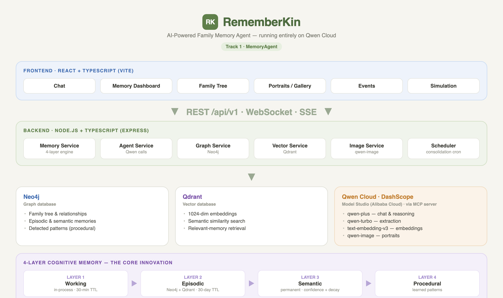

# Rememberkin

An AI-powered platform to preserve, organize, and share family memories across generations. Built with Qwen AI, Neo4j graph database, and Qdrant vector search.

> **Global AI Hackathon Series with Qwen Cloud — MemoryAgent track.**
> Rememberkin is an agent with truly persistent memory: a 4-layer cognitive memory system (Working → Episodic → Semantic → Procedural) that recalls family facts across sessions, consolidates them over time, and learns household patterns. Built entirely during the hackathon, it directly targets the track's three pillars: **efficient memory storage and retrieval** (Neo4j graph + Qdrant vector hybrid), **timely forgetting of outdated information** (confidence decay and automatic pruning of weak memories), and **recalling critical memories within limited context windows** (an optimized context selector injects only the most relevant facts per turn). Powered end-to-end by Qwen models on Qwen Cloud (`qwen-plus`, `qwen-turbo`, `text-embedding-v3`, `qwen-image-2.0`).
>
> 📹 **Demo video:** _[add YouTube/Vimeo link here — max 3 minutes]_
> ☁️ **Alibaba Cloud proof:** all AI runs on Alibaba Cloud Model Studio (DashScope) — see [`backend/src/config/qwen.ts`](backend/src/config/qwen.ts) and the Function Compute deploy definition [`s.yaml`](s.yaml). Full guide: [dev-docs/DEPLOYMENT.md](dev-docs/DEPLOYMENT.md).
> 🧠 **Also includes:** an MCP server exposing memory as tools, and a self-evaluation harness (scored 100 on memory recall, context relevance, and entity extraction).

## Overview

Rememberkin helps families:
- **Preserve Stories**: Share and store family stories with AI-powered summarization
- **Build Family Trees**: Visualize family relationships in an interactive graph
- **Extract Memories**: Automatically extract facts and memories from conversations
- **Stay Connected**: Get reminders for birthdays, anniversaries, and important events
- **Search Semantically**: Find memories using natural language queries
- **Multi-Layer Memory**: 4-layer cognitive memory system (Working → Episodic → Semantic → Procedural)

## Tech Stack

### Frontend
- **React 18** with TypeScript
- **Vite** for fast development and building
- **TanStack Query** for server state management
- **Zustand** for client state management
- **Tailwind CSS** + **shadcn/ui** for styling
- **ReactFlow** for family tree visualization
- **Lucide React** for icons

### Backend
- **Express.js** with TypeScript
- **Neo4j** graph database for family relationships
- **Qdrant** vector database for semantic search
- **Qwen AI Cloud** for LLM and embeddings
- **WebSocket (ws)** for real-time features
- **JWT** for authentication

## Architecture



<details>
<summary>Text version</summary>

```
┌─────────────────────────────────────────────────────────────────┐
│                         Frontend (React)                         │
├─────────────────────────────────────────────────────────────────┤
│  Pages: Home, Chat, Family, Stories, Events, Search, Simulation │
│  Components: ChatWindow, FamilyTree, StoryCard, EventCard       │
│  Services: API, WebSocket, Auth, Chat, Story, Event, Search     │
│  State: AuthStore, ChatStore, NotificationStore (Zustand)       │
└─────────────────────────────────────────────────────────────────┘
                              │
                              ▼
┌─────────────────────────────────────────────────────────────────┐
│                      Backend (Express.js)                        │
├─────────────────────────────────────────────────────────────────┤
│  Routes: /auth, /family, /members, /stories, /chat, /events,    │
│          /memories, /search, /simulation, /images               │
│  Services: GraphService, VectorService, AgentService, Scheduler │
│  Middleware: Auth (JWT), Error Handling                          │
│  WebSocket: Real-time presence, typing, notifications           │
└─────────────────────────────────────────────────────────────────┘
                              │
              ┌───────────────┼───────────────┐
              ▼               ▼               ▼
        ┌──────────┐   ┌──────────┐   ┌──────────┐
        │  Neo4j   │   │  Qdrant  │   │ Qwen AI  │
        │  Graph   │   │  Vector  │   │  Cloud   │
        │    DB    │   │    DB    │   │   API    │
        └──────────┘   └──────────┘   └──────────┘
```

</details>

## Memory System

Rememberkin implements a 4-layer cognitive memory system:

```
┌─────────────────────────────────────────────────────────────────┐
│  LAYER 1: WORKING MEMORY (Ephemeral)                            │
│  • Current conversation context                                  │
│  • Active entities being discussed                               │
│  • Pending facts awaiting consolidation                          │
└─────────────────────────────────────────────────────────────────┘
                              │ After each message
                              ▼
┌─────────────────────────────────────────────────────────────────┐
│  LAYER 2: EPISODIC MEMORY (Short-term)                          │
│  • Conversation sessions as episodes                             │
│  • Importance scoring (emotional valence, participants)          │
│  • Access tracking (how often recalled)                          │
└─────────────────────────────────────────────────────────────────┘
                              │ Consolidation
                              ▼
┌─────────────────────────────────────────────────────────────────┐
│  LAYER 3: SEMANTIC MEMORY (Long-term)                           │
│  • Consolidated facts with confidence                            │
│  • Reinforcement counting                                        │
│  • Decay factor for relevance                                    │
└─────────────────────────────────────────────────────────────────┘
                              │ Pattern detection
                              ▼
┌─────────────────────────────────────────────────────────────────┐
│  LAYER 4: PROCEDURAL MEMORY (Patterns)                          │
│  • Learned behaviors and routines                                │
│  • Trigger-action patterns                                       │
│  • Family preferences                                            │
└─────────────────────────────────────────────────────────────────┘
```

## Getting Started

### Prerequisites

- Node.js 18+
- Neo4j database (cloud or local)
- Qdrant vector database
- Qwen AI Cloud API key

### Environment Setup

1. **Clone the repository**
```bash
git clone <repository-url>
cd RememberKin
```

2. **Backend Setup**
```bash
cd backend
cp .env.example .env
# Edit .env with your credentials
npm install
npm run dev
```

3. **Frontend Setup**
```bash
cd frontend
cp .env.example .env
# Edit .env if needed
npm install
npm run dev
```

### Environment Variables

#### Backend (.env)
```env
# Server
PORT=6100
NODE_ENV=development

# Neo4j
NEO4J_URI=neo4j+s://xxxxx.databases.neo4j.io
NEO4J_USER=neo4j
NEO4J_PASSWORD=your-password

# Qdrant
QDRANT_URL=http://localhost:6333
QDRANT_API_KEY=

# Qwen AI
QWEN_API_KEY=your-qwen-api-key
QWEN_BASE_URL=https://dashscope-intl.aliyuncs.com/compatible-mode/v1

# JWT
JWT_SECRET=your-super-secret-jwt-key
JWT_EXPIRES_IN=7d

# CORS
CORS_ORIGIN=http://localhost:6101
```

#### Frontend (.env)
```env
VITE_API_URL=http://localhost:6100/api/v1
VITE_WS_URL=ws://localhost:6100/ws
```

## Features

### AI Chat with Memory
- Natural language conversations about family
- Context-aware responses using family data
- Memory extraction and recall
- Related story suggestions

### Family Management
- Create and join families
- Invite members via email
- Define relationships (parent, spouse, sibling)
- View interactive family tree

### Story Sharing
- Share stories with rich text content
- AI-powered summarization and mood detection
- Automatic entity extraction
- Visibility controls

### Image Generation
- AI-generated family portraits
- Celebration and milestone images
- Seasonal family photos
- Template-based generation

### Simulation Testing
- Automated test scenarios
- Live conversation monitoring
- Performance scoring
- Cost tracking

## Project Structure

```
RememberKin/
├── frontend/
│   ├── src/
│   │   ├── components/
│   │   ├── pages/
│   │   ├── services/
│   │   ├── store/
│   │   └── types/
│   └── package.json
│
├── backend/
│   ├── src/
│   │   ├── config/
│   │   ├── routes/
│   │   ├── services/
│   │   └── utils/
│   └── package.json
│
├── test-scripts/
│   └── simulation/
│       └── family/        # Family test scenarios
│
├── mcp-server/            # MCP stdio server (exposes memory as tools)
├── assets/                # Architecture diagram + demo photos
└── dev-docs/              # Architecture, deployment & API docs
```

## Scripts

### Backend
```bash
npm run dev      # Start development server with hot reload
npm run build    # Build for production
npm start        # Start production server
```

### Frontend
```bash
npm run dev      # Start development server
npm run build    # Build for production
npm run preview  # Preview production build
```

## Cost & Abuse Protection

Built for safe public judging:

- **Hard AI spend cap** — every Qwen call (chat, extraction, embeddings, images) passes through a budget-guarded client. Cumulative cost is metered per response and persisted in Neo4j; once `MAX_TOTAL_COST_USD` (default $10) is reached, AI calls fail fast with HTTP 429 before any tokens are spent. Live meter: `GET /api/v1/usage/budget`.
- **Rate limiting** — per-user/IP fixed-window limits: 120 req/min globally, 20/min chat, 30/min search, 5/min image generation, 15/min auth (brute-force protection).

## MCP Integration

RememberKin ships an [MCP (Model Context Protocol)](https://modelcontextprotocol.io) stdio server ([`mcp-server/`](mcp-server/)) that exposes the family memory agent to any MCP client — Claude Desktop, Cursor, Claude Code. It authenticates as a normal user (JWT cached, auto re-login) and provides 5 tools: `search_family_memories`, `get_family_tree`, `get_semantic_memories`, `get_upcoming_events`, and `ask_family_agent`. Build with `cd mcp-server && npm install && npm run build`, then register it in Claude Desktop:

```json
{
  "mcpServers": {
    "rememberkin": {
      "command": "node",
      "args": ["/absolute/path/to/RememberKin/mcp-server/dist/index.js"],
      "env": {
        "REMEMBERKIN_API_URL": "http://localhost:6100/api/v1",
        "REMEMBERKIN_EMAIL": "mary@test.local",
        "REMEMBERKIN_PASSWORD": "test12345"
      }
    }
  }
}
```

See [mcp-server/README.md](mcp-server/README.md) for details.

## Deployment

The backend deploys to **Alibaba Cloud Function Compute** with the official [Serverless Devs](https://docs.serverless-devs.com) CLI ([`s.yaml`](s.yaml)), with the frontend on OSS static hosting and managed Neo4j Aura + Qdrant Cloud. See [dev-docs/DEPLOYMENT.md](dev-docs/DEPLOYMENT.md) for the full guide (including a single-ECS Docker Compose alternative), or run everything locally:

```bash
docker compose up -d --build
```

## License

This project is licensed under the MIT License — see [LICENSE](LICENSE).
